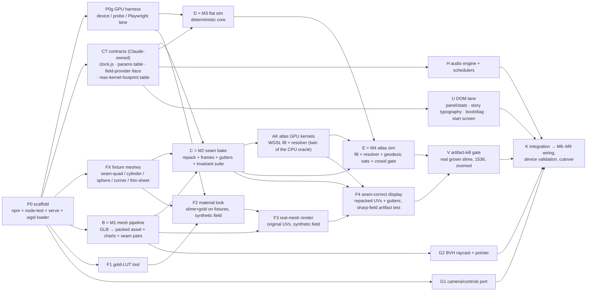

# A Bestiary of Vanishings — WebGPU rewrite plan ("v2")

> Status: authored 2026-08-14 at commit `b113413` by Claude (Fable 5) after full-code
> reconnaissance. Execution is intended for Codex (GPT-5.6) working milestone-by-milestone from
> `v2/briefs/`. This file is the single source of truth for scope, order, and acceptance.
> Reference material distilled from the legacy code lives in `v2/reference/` — Codex should read
> those instead of spelunking the 20k-line `main.js`.
>
> Repo-wide caution (applies to every doc, including this one): files are *non-authoritative* —
> when a claim matters, verify against code or a test before building on it. `SEAM_NOTES.md`
> (repo root) is the seam-bug knowledge dump; its taxonomy has been spot-verified and is the
> best available account, but it self-describes as fallible.

## 0. Goal, constraints, non-goals

**Goal:** a clean-room, WebGPU-native rewrite of the art game currently in `index.html` +
`main.js` (WebGL2/three.js, ~20k lines, heavily mitigated seams), reproducing the game 1:1 in
feel and content, killing all three seam artifacts *by construction*, and landing an
order-of-magnitude perf/memory win that unlocks better mobile settings.

**Three mandates from the artist (2026-08-15):**
1. **Every line is new.** Legacy code (main.js, index.html, styles.css, webgpu/*) is *reference
   semantics only* — it is never copied, pasted, or "transplanted". What carries over verbatim:
   **assets and constants** (numbers, timings, preset tables, clip gains — extracted as data),
   never code. This applies to the engine, the UI DOM/CSS, and the audio graph alike.
2. **Parity first.** This track optimizes for faithfulness to the legacy organism and look; the
   parallel physarum-18 track optimizes for determinism/robustness — the two deliberately take
   opposite defaults on contested forks (see the Delta Ledger) so the artist compares real
   builds, not arguments. Determinism machinery here is a *testing tool* and never overrides a
   parity semantic.
3. **Written to be read.** The 20k-line monolith is the cautionary tale. Readability and
   navigability are explicit implementation priorities with concrete standards (§2) and a
   review gate at every milestone — clever-but-opaque loses to clear, and only a measured hot
   spot may buy complexity with a comment justifying it.

**Hard constraints**
- Static GitHub Pages deploy (CNAME `bestiaryofvanishings.com`), **no build step** for the shipped
  page. Dev tooling (Node ≥ 24, Playwright) is fine — it just can't be required to serve the game.
- v2 is **additive** until the final cutover: it lives entirely under `v2/`, never touches legacy
  files, and deploys alongside them (testable on real iPhones at `/v2/…` as soon as main updates).
- Browsers: WebGPU-only — Chrome/Edge stable, Safari 26+/iOS 26+, and Firefox on platforms where
  its WebGPU has shipped (141+ is Windows-only; other platforms arrived later or are pending). No
  WebGL fallback — the legacy build remains reachable for everything else.
- Assets are reused, not re-authored: `luyvwj-fwgyww.glb` (geometry only — its embedded texture is
  unused by the game, verified `main.js:15379`), `shen-soundpack/`, `stories.json`,
  `material data/thicker_au_rgb_thickness_angle_tensor.json`. The `seam-bake-*.bin` files are
  legacy-only and dead in v2.

**Non-goals:** new gameplay/content; supporting the old `?webgpu`/`?seam` prototype flags;
porting `slimemold.html`/`skin.html`/`gold_wafer_viewer.html`; WebGL fallback.

## 1. The load-bearing decision: seam architecture

This is the reason the rewrite exists. `SEAM_NOTES.md` establishes (spot-verified):

- The sim field **is** the mesh's Tripo-generated UV atlas: 1,233 charts, ~60,068 boundary
  segments, **< 1 texel of gutter** — the packer reserved no clearance. That is the root difficulty.
- Three distinct artifacts: **#1** jagged lit facets (bump taps crossing texel-quantized seam
  resolution — fixed by the shipped per-edge full-affine "ptex" resolver), **#2** black
  seam-straddling triangles (fragments gated to zero on non-authoritative texels), **#3** blocky
  chart-edge staircases on real grown slime — *what the artist actually sees* — caused by the field
  cliffing to zero past a 1-texel halo, which bilinear cannot smooth across. #2 and #3 are unfixed
  in legacy, and unfixable there without another mitigation layer (forbidden by hard-won precedent).
- The invariant any correct fix must satisfy: *every rendered fragment maps to a texel whose full
  bump-tap + bilinear footprint reads same-surface real data with a continuous value and a
  consistently-rotated gradient across seams.*
- The correct cross-seam map is a **full metric affine** per directional seam edge (the atlas is
  non-isometric; anything less leaves the *derivative* discontinuous). One refinement over the
  shipped ptex build (adversarial review #1, finding 2): legacy's `M = pinv(J_dst)·J_src` is an
  *extrinsic projection* that collapses transverse displacement at folded seams (thousands of
  pairs fold > 60° on this mesh) — and its synthetic `f(worldPos)` validation was structurally
  blind to this. v2 uses the **hinge-unfold affine** `M = pinv(J_dst)·R_hinge·J_src` (rotate the
  source tangent plane onto the destination plane about the shared 3D edge, then map), which is
  the correct transport for an intrinsic surface field and reduces to legacy's form exactly on
  coplanar pairs.

**v2 design — correct by construction, decided:**

1. **Repack the atlas with real gutters (bake-time).** We own the asset pipeline now, and the
   GLB's embedded texture is unused, so chart UVs can be remapped freely (per-chart
   scale/translate only — parameterizations untouched). The bake tool repacks all charts with a
   guaranteed `GUTTER` texels of clearance at each target field size (GUTTER is derived from the
   CT contract's maximum single-pass kernel-footprint table, nominally 4) and a minimum chart
   footprint (kills the sub-texel/quarantined-chart class outright). This is what makes a filled
   gutter *physically possible* — legacy had no room to write one. Two measured realities the
   bake must handle (verified by independent audit, `reviews/mesh-audit-results.md`):
   **same-chart slit seams** — 3,592 edge pairs whose two sides sit inside one connected chart
   with unrelated surface between them; the splitter's work unit is the **chart-local component
   (expect 630;** endpoint-connected grouping gives 570 but merges across charts — review #3;
   19 components branch, 5 are closed loops, both handled per the M2 spec). Each component is
   extended to the chart boundary along mesh edges and the chart split, duplicating vertices
   along the cut in the bake's own reindexed geometry, with topology postconditions tested. A
   boundary-reaching extension always exists in a connected chart, so the splitter **always
   succeeds — there is no resolver-only fallback** (display and diffusion have no resolver; an
   unsplit slit would be a field cliff). And **packing pressure**: per-chart
   GUTTER=4 dilated demand measures 117.3% of 768² (why 768 is dead), **99.2% of 1024²**, and
   82.4% of 1536² *by texel-center counting* — and review #5's re-audit under the conservative
   any-touched-texel rule M2 actually mandates pushes 1024 to **~107% at G4, ~94% at G3, ~93%
   at G4 with a 0.9 density lever** (each still a pre-split lower bound). Consequence: mask
   packing is required everywhere, bbox is ruled out, and the mobile bake plans for **combined
   levers** (G3 *and* density-as-needed, targeting measured demand ≤ ~85%) with **1280 as the
   explicit fallback field size** (legacy even shipped a 1280 bake) if the combination still
   fails its gate — the M2 gate decides on conservative post-split numbers, not these bounds.
2. **Geodesic-filled gutters (bake-exact, runtime-cheap).** For every gutter texel the bake
   computes a donor by an exact **geodesic mesh walk**: cross the boundary and continue over the
   surface, triangle by triangle, as far and through as many charts as the offset requires (CPU
   cost at bake time is irrelevant). This matters because a single per-edge affine is only valid
   over its defining triangle, and the adjacent-triangle altitude is **median 1.49 texels** on
   this mesh (59,215 of 60,068 sides < 4 texels — audit-verified): affine-extrapolated gutters
   would be wrong almost everywhere past the first texel, and narrow charts (MIN_CHART = 4)
   would be untraversable. Walk-based donors follow a fully constructive per-texel rule (entry
   point, tie-breaks, entry triangle, tangent mapping — spelled out in M2); at cone points
   (angle defect ≠ 0 — measured: 181 positive, 1,358 negative) no method can be C1 *through*
   the vertex, so corners are C0 with a gradient-error radius that is **measured by the suite**
   (cross-bisector donor jumps included), not assumed, and artist-judged. Donor records are
   **gather stencils** — up to 4 authoritative texels + weights approximating the walk endpoint
   (existence guaranteed even where no all-authoritative bilinear footprint exists) — which is
   also what makes the runtime fill a single race-free pass. The fill uses `read_write`
   storage access on the `r32float` field where the `readonly_and_readwrite_storage_textures`
   WGSL language extension is available (probed in M0 — it is an extension, not core), else a
   staging-copy fallback (~9 MB copy per fill; the M0 workload rehearsal benchmarks **both**
   paths). The display copy's fill reads **the display texture itself, post-EMA/blur** — never
   the raw sim field, or gutters would lag authoritative texels by exactly the temporal
   smoothing and re-draw a seam. Display then samples with **plain bilinear — zero seam logic
   in any hot shader**; bump taps (≤ 2.33 texels), bilinear, and seam-straddling fragments all
   land on real, walk-consistent data: artifacts #1, #2, #3 are gone by construction for every
   footprint ≤ GUTTER, and wider kernels iterate (point 3).
3. **Affine resolver for the sim (runtime).** Agent sensing reaches ~12 texels (`sensorDistance`
   0.008 UV) — far beyond any gutter — and movement crosses seams. These use the ptex semantics
   ported from `main.js` (`ptexResolverGlsl`/`agentMoveResolverGlsl`) with two upgrades: the
   hinge-unfold affine above, and heading transport via **`normalize(M·d)`** instead of legacy's
   constant per-edge rotation (a constant angle is wrong under shear; M is already in the frame,
   so the correct transport is free). Structure: full-field boundary-frame index (u32/texel;
   per-texel frame *list* at corners — fixing legacy's single-winner gap) + per-edge affine
   frames, conservative failure (hold, never teleport). Scope honesty: the resolver is
   **single-hop with endpoint-only validation, exactly like legacy's** (main.js:2200/2258 check
   the endpoint's chart, not the path — so a chord that leaves and re-enters a chart *tunnels*,
   and that is parity, not a bug to fix; a two-seam ray whose endpoint chart doesn't match fails
   conservatively). The bake measures how often multi-seam-reach geometry occurs, and "correct
   by construction" claims cover display, diffusion, and single-hop transport only. Diffusion's
   3×3, by contrast, just reads the filled gutters — uniform plain loads everywhere, no
   resolver, no interior/boundary split (its per-texel anisotropy across differently-scaled
   charts is inherited legacy behavior, kept for parity and stated rather than hidden).
   **Writes stay authoritative-only, so wide write kernels become point-deposit + blur.** Legacy
   splats each agent's crowd presence as a multi-texel point sprite (sizing `main.js:773`,
   `gl_PointSize` 3545, ~4-texel radius at defaults; food deposits use the same material at a
   ~point-sized radius, so point-deposit is already *parity* for food) and needed the
   mirror-splat/transition-atlas path to land crowd mass across seams — the machinery whose loss
   caused SEAM_NOTES §8's residual growth gap. v2 must not reproduce that gap by writing splats
   into gutters (derived data, overwritten by the next fill). Instead: agents deposit to their
   own authoritative texel; **crowd** deposits use bilinear (fractional) scatter — four weighted
   atomicAdds, sub-texel-continuous like legacy's moving sprites — while **food-deposit exposure
   is single-texel** (legacy's deposit sprite clamps to 1 px, main.js:780 — texel-snapped is the
   parity, review #4). Scatter taps that land on gutter texels **forward through the fill
   stencil's transpose** (adjoint scatter: the gutter texel's donor stencil, run backward, in
   4 more atomicAdds) — mass lands on the authoritative texels the gutter mirrors, so nothing
   is lost to the next fill and phase continuity holds across seams. Amplitude is
   **peak-semantics, not normalized-mass**: legacy's splat writes
   `smoothstep(1,0,(d/r)²) · clamp(reserve) · massScale` per texel (main.js:3595-3603) — peak
   fixed, mass ∝ radius² — so the v2 scatter scales by the kernel integral; a mass-normalized
   blur would silently shrink sensed crowd as radius grows. Scatter follows **legacy's own size
   law** (review #5): legacy snaps to a 1-px sprite whenever `max(1, densityBlur/4·scale) ≤ 1`
   — so at low slider values v2 deposits single-texel-snapped (parity), and bilinear scatter
   engages only in the regime where legacy's sprite really moves sub-texel-continuously; the
   phase test runs per regime. Fixed-point scale is **derived analytically from the no-overflow
   bound** — S ≈ 2³²⁄(capacity × max per-agent contribution) ≈ 300 on u32 gives provable
   no-wrap at full co-location *and* finer granularity than legacy's own 8-bit field (1/300 vs
   1/255) — with a full-capacity-on-one-texel test. The kernel is realized as **iterated
   near-isotropic 3×3 passes with gutter re-fill between passes**; on ping-ponged passes the
   fill fuses **correctly, as the composition** — a gutter output is the stencil applied to the
   *blurred* values, i.e. `Σ wᵢ·(3×3 over the input at tapᵢ)` evaluated in the same pass (36
   gathers on ~30% of texels; review #5 caught the naive fusion writing one-iteration-stale
   gutters) — so no extra dispatch or staging copy, and the M0 rehearsal benchmarks this
   composed pass, not the obsolete separate path. Iterated-isotropic
   fixes the **rotation** half of the separability defect (review #2); the **scale/shear** half
   is chart-metric covariance every per-texel kernel has — legacy's diffusion and display
   smoothing included — and is *inherited, documented, and measured* by the impulse-spread test,
   not claimed away (review #4 corrected round 3's "no caveat" overreach). σ derives from the
   legacy disc's second moment (per-axis ≈ 1.45 at default ⇒ ~4–5 passes) and iteration covers
   the whole slider range — the worst-case matrix (max radius × max simulationSteps) is a
   **mandatory M0 rehearsal row** with the result recorded before M2 freezes GUTTER. Crowd
   sensing clamps to [0,1] AND **quantizes to 1/255 steps post-blur (full saturating-RGBA8
   parity — the artist's parity mandate upgraded this from "documented delta" to default;
   `?crowdfloat=1` keeps the float variant)**, and reads **nearest/texelFetch — legacy bypasses
   its own linear filter when sensing (main.js:3063), so bilinear sensing would be anti-parity**
   (review #4 corrected round 3 here too). Direct-tap rule stands: shader taps
   clamp at GUTTER−1 per size, larger smoothing realized in the display blur the taps read.
   Profile matched in M3 at default and slider extremes (sub-texel phases, reserve weighting,
   saturation-aware superposition, radius-amplitude scaling); cross-seam radial profile in M4.
4. **World-space kernels for oats and pointer repulsion.** The bake rasterizes a per-texel
   worldPos (+tangent frame) map. Oat influence and repel become functions of 3D distance —
   cross-seam feeding is exact with no seam machinery at all. This dissolves the
   `ptex-delete-atlases` growth regression (legacy's 4-candidate transition atlases existed
   largely to feed oats/density across seams; see SEAM_NOTES §8). Known cost (a conscious
   behavior change, not parity): raw Euclidean distance can couple through geometry that is
   close in space but far on the surface. The primary gate is **connectivity, not normals**
   (review #4): the bake emits the chart-adjacency graph (an **M2 deliverable**, per-size);
   each oat attenuates by **approximate geodesic distance over a block graph** (~32²-texel
   blocks, edges from the baked chart adjacency; per-oat Dijkstra at placement time — sub-ms on
   a ~2,300-node graph), interpolated continuously between block centers. Cross-review from the
   parallel track killed the previous hop-step weights (1/0.5/0): stepped weights put a 2× food
   edge exactly at chart boundaries — the artifact class this rewrite exists to kill — and left
   the hairpin residual unsolved, while geodesic attenuation fixes both with data the bake
   already emits. Its traps, pre-paid by that track: seed Dijkstra from the **anchor point, not
   the anchor's block** (block-seeded fields snap at block boundaries and all anchors in a block
   would share one field); use the distance for **attenuation, not admission-only** (a binary
   gate with 3D amplitude re-admits near-fold pairs at near-peak strength); the near-field
   direct-UV shortcut is valid only where UV adjacency bounds surface distance — fixture that
   argument; the oat's radius converts
   from legacy's UV-space value via **its own chart's baked texel-world scale** (r_world =
   r_uv · chartScale — review #5 pinned the missing conversion). Normal agreement is at most a
   secondary damp. The former same-chart-hairpin residual is now fenced by actual surface
   distance (that was the point of switching to geodesic attenuation); the **hairpin fixture**
   stays as the regression test proving it. Pointer repel keeps **legacy's UV + chart-gate semantics verbatim**
   (main.js:3146); any other statement about repel elsewhere is stale and this one wins.
5. **CPU-verifiable before any GPU exists.** All of 1–4 are bake-time constructions, so the seam
   invariant is enforced by a Node test suite (M2) — value *and* gradient continuity across every
   seam, on smooth *and sharp-edged* test fields (the sharp case is the exact hole ptex validation
   fell into), agent transport round-trips, packing-clearance proofs — before a single WGSL kernel
   touches it.

**What this deletes from the legacy design:** seam-bake bins + 4 transition atlases (~600 MB at
1536 — the reason mobile is pinned to 768) + redirect/weld atlases + equalize/clip passes +
`a_renderUv` fallback + micro-chart quarantine + the 16-fetch `safeSamplingGlsl` cascade + the
6-pass display smoothing chain's seam duties + `EXT_float_blend`-class workarounds. Replaced by:
one bake tool, one gutter-fill dispatch, one small resolver used only by agent kernels.

### 1.5 The Delta Ledger — every knowing deviation from legacy semantics

Parity-first means deviations are *enumerated, flagged, and judged* — never scattered through
prose. This table is exhaustive by contract: an implementer who deviates from legacy in any way
not listed here has a bug or must add a row (with Claude's sign-off).

| Delta | Class | Parity flag? | Judged at |
|---|---|---|---|
| The seam architecture itself (filled gutters, walk donors, resolver, adjoint scatter) | seam-fix — the reason v2 exists | `?gutter=0` (diagnostic; shows the legacy-class cliff) | M2 suite + M5 artifact-kill + artist |
| Heading transport `normalize(M·d)` vs legacy's constant per-edge rotation | seam-fix (correct under shear) | flag to constant-rotation for A/B | M4 fixtures + artist |
| Direct bump taps clamped at GUTTER−1; wider smoothing realized in display blur | seam-fix-forced | none feasible (legacy's 10.6-texel taps cannot coexist with gutters) | M5 artist at slider extremes |
| Crowd kernel realized as scatter + iterated isotropic blur vs write-side sprites | platform (no point sprites in compute) | n/a — profile-matched, per-regime tests | M3 profile + M4 cross-seam + artist |
| Oat/repel cross-seam feeding via geodesic attenuation vs legacy transition atlases | seam-fix (legacy machinery deleted) | n/a | M4 fixtures + growth envelope + artist |
| Crowd-field 8-bit quantization | **parity by default** (round to 1/255 post-blur) | `?crowdfloat=1` for the float-precision variant | M3 tests run quantized |
| Timebase | **parity by default**: legacy wall-clock law (`rawDt = min(elapsed/16.667, 2.2)` over substeps, un-dt'd per-substep diffusion/decay — refresh-dependent, documented) | `?fixedtick=1` (60 Hz-equivalent accumulator; physarum-18's default — the two tracks take opposite defaults so the artist compares real builds) | M4/M5 A/B, artist decides the shipped default |
| Mesh-walk gutter data replaces seam-bake bins/atlases | seam-fix | n/a | M2 suite |
| No mips (legacy parity) — noted for completeness | parity kept | n/a | M5 distant-camera check |

## 2. Runtime architecture

**Stack:** raw WebGPU for *all* GPU work. three.js r170 (vendored under `v2/vendor/`, no CDN) is
used **CPU-only** as a math/scene utility: `PerspectiveCamera` + `OrbitControls` (so every damping
/limit constant transfers 1:1) and `three-mesh-bvh` for raycasts (oat drop, repel, story-box
occlusion). No `WebGLRenderer`, no `WebGPURenderer`, no TSL. WebAudio and DOM/CSS port from legacy
nearly verbatim.

**Directory layout**
```
v2/
  index.html          game shell (M8; until then a stub pointing at dev.html)
  probe.html          WebGPU capability report (M0)
  dev.html            dev harness: flat sim, atlas sim, debug views (M3+)
  src/
    gpu/              device init, format caps, bind-layout helpers, buffer/texture registry
                      (byte-accounted), wgsl loader/preprocessor, error scopes, device-lost UX
    sim/              sim.js + WGSL kernels (agents, deposit, diffuse, oat field, gutter fill)
    atlas/            packed-asset loader, seam resolver WGSL snippet, gutter tables, and the
                      GPU gutter-fill kernel (owned by Track A; consumed by both the sim and the
                      renderer)
    render/           renderer.js, slime.wgsl, gold.wgsl, sprites, debug views, display chain
    game/             clock.js, flow/intro/ending, stories, oats, input, panel, stats, save-load
    audio/            engine (context/unlock/one-shots), schedulers (clock-injectable), graph
  vendor/             three.module.js@0.170.0, OrbitControls.js, three-mesh-bvh@0.8.3 (committed)
  assets/             tool outputs, committed as per-section gzipped files (mesh geometry shared;
                      uv1/frames/rasters/gutter tables PER SIZE for 1536 and 1024 — repacks don't
                      share UV space); every emitted file asserted < 95 MB (GitHub's hard limit is
                      100 MB and Pages can't serve LFS); inflated at load via DecompressionStream
  tools/              bake.mjs (glb→mesh→charts→repack→seams→raster→pack), goldlut.mjs,
                      verify-seams.mjs, fixtures.mjs (synthetic test meshes), shared libs
  tests/              node/ (tools + pure logic), browser/ (Playwright specs), fixtures/
  package.json        devDeps only (playwright); scripts: bake, test, test:node, test:gpu
  PLAN.md  briefs/  reference/  reviews/
```

**GPU frame (default settings), replacing legacy's ~33 fullscreen passes + 6-pass smoothing —
in legacy's order** (main.js:18098: density → agents → **diffuse → deposit → delta**; review #3
caught the reversal): per sim step — oat-field refresh (dirty-flagged, geodesic-attenuated kernels) →
crowd scatter + iterated 3×3 (fill between passes) → agent compute (survivors pass, then
children pass; indirect dispatch; admission finalize) → diffuse+decay → **exposure scatter over
the final population** → delta apply (each field write followed by its gutter fill); per frame —
display copy → temporal EMA (r32float history accumulator, legacy-parity) → **fill** →
[iterated display blur pass → fill] × n → 16-bit filterable sample view → one render pass (gold
body → slime film → sprites/overlays) → stats/trigger readbacks (mapAsync, throttled). Everything
labeled (`pushDebugGroup`), error-scoped in dev.

**Formats:** sim field, oat field, and density `r32float` storage ping-pong; the in-place gutter
fill uses `read_write` storage access **where the `readonly_and_readwrite_storage_textures` WGSL
language extension is available** (an extension, not core — probed in M0; staging-copy fallback
otherwise); agents 32 B structs `{vec2f pos, f32 heading, f32 reserve, u32 id_lo, u32 id_hi,
u32 flags}` (**64-bit ids** — u32 hash ids collide at planned populations) in storage buffers;
boundary index `r32uint` texture; frames + gutter tables in storage buffers; LUT
`rgba8unorm-srgb` 600×256. Display chain formats (legacy-parity, review #3 finding 21): the
**EMA history accumulator is `r32float`** (legacy desktop keeps f32 history, main.js:1702-1712 —
f16 accumulation stalls below its ulp) and only the final **filterable sample view** is 16-bit:
`r16float` written via render passes (core-renderable; its storage binding needs optional
texture-formats-tier1) or `rgba16float` storage-written — chosen by the gpu/ format helper from
M0 probe data; never assume tier1.

**Memory (computed by `tools/audit/memory-budget.mjs` — twice hand-mis-added, so the script is
the source of truth and this prose is copied from its output, never edited by hand).**
Current output: **235–298 MB steady @1536** (branch-dependent: f16 maps ± / display r16f vs
rgba16f, with the r32float EMA history and max-food history itemized, 28 B stencil records),
plus 30–90 MB canvas-dependent depth/swapchain and a ~41 MB transient load peak; **127–155 MB
@1024** (+ ~10–30 MB canvas + ~28 MB transient). Gutter records use the *measured pre-split* 30%/47%
fractions with 28 B stencil records; the bake re-measures post-split. Honest
comparison: desktop is *comparable to* legacy's ~306 MiB while carrying **4× the texels**;
mobile is roughly half of legacy's at 1.8× the texels. Per-item accounting is enforced at
runtime by the gpu/ registry; the mobile budget uses these numbers (fixed-size items don't
scale with N).

**Design rules (all milestones):**
- **Timebase: PARITY DEFAULT on this track (artist mandate + cross-review):** legacy's law
  (`rawDt = min(elapsed/16.667, 2.2)` split over substeps, diffusion/decay per-substep un-dt'd —
  main.js:18632/2532) ships as the default, with its **monitor-refresh dependence documented as
  artist-visible** (120 Hz runs ~2× the decay/diffusion steps per second of 60 Hz — that is the
  legacy organism, faithfully). `?fixedtick=1` provides the 60 Hz-equivalent accumulator
  variant (tested-path == shipped-path; the physarum-18 track takes it as *its* default — the
  fork resolves by comparing real builds at the M4/M5 gates, and the artist picks the shipped
  default knowingly). Determinism tests pin elapsed under either mode; the controller samples
  wall-clock under parity, step boundaries under fixed tick.
- **Determinism is a feature — defined as state-set determinism below capacity.** Persistent
  agent `id`, children's ids derived from `(parentId, step, k)` (never slots), PCG-style counter
  RNG keyed `(id, step, stream)`, no `Math.random` in sim paths. Same seed ⇒ identical *set* of
  agents and identical field, verified by an order-independent hash (atomic append makes buffer
  *order* scheduler-dependent — see M3 fix 3). This is what makes every later test (goldens,
  artifact-kill, save/load) possible.
- **Injectable clock.** All timelines (intro, ending, stories, audio schedulers, decay) read
  `game/clock.js` (`now()`, `timeScale`) — the whole game flow must be testable at 20× speed.
- **Explicit unit semantics per parameter.** Every sim parameter is documented as surface-space,
  UV-space, or texel-space, with its FIELD_SIZE scaling written down (legacy precedent:
  `SPLAT_FIELD_SCALE`; per-texel kernels like the 3×3 diffusion and the crowd blur change
  physical meaning with resolution). This is what makes a later resolution change a *scaling*
  instead of a silent retune of the organism — see M10.
- Explicit `GPUBindGroupLayout`s everywhere; pipelines/bind groups created once; zero per-frame
  allocation (encoder only).
- WGSL in `.wgsl` files, fetched at init through a minimal tested preprocessor (const injection +
  `//#include`).
- Relative URLs robust to being served at `/` or `/v2/`.
- **Written to be read (artist mandate — concrete, gated standards, not vibes):**
  small single-purpose modules (~≤400 lines; the pass graph in code uses the same names as §2's
  frame list); every WGSL kernel opens with a **contract comment** (inputs/outputs, formats,
  units, invariants, and the PLAN/brief section it implements); one project **glossary**
  (`src/shared/GLOSSARY.md`: gutter, donor stencil, authoritative, exposure, hop, walk…) that
  code names must match; units live in names (`uvPos`/`texelPos`/`worldPos`, per the unit
  table); comments state *why* and *invariants*, never narrate the next line; every non-obvious
  constant cites its legacy anchor or derivation; prefer the straightforward form — only a
  *measured* hot spot may buy complexity, with a comment carrying the measurement. Milestone
  gates include a readability review (§5).
- **Never generate mips on atlas textures** — ordinary mip generation averages unrelated packed
  charts and destroys the gutter guarantee. Legacy shipped mip-free (RT sampling); v2 keeps that
  parity, the display chain is the anti-aliasing mechanism, M5 includes a distant-camera artist
  check, and a chart-aware mip chain is post-M10 future work only.
- Parameter names, ranges, defaults, and preset tables transplanted verbatim. Source of truth for
  *values* is direct extraction from `main.js:325–546` (defaults + both preset tables) — the
  parity checklist §2 lists names/ranges but not every value, so it serves as the completeness
  cross-check, not the source.
- Perf numbers append to `v2/perf-log.ndjson` (informational, never a gating assert).

## 3. Test strategy

| Layer | Runner | What it proves |
|---|---|---|
| Tool/unit | `node --test` (zero deps) | GLB parsing vs known counts; packing clearance proofs; **the M2 seam-invariant suite** (value+gradient continuity across every seam on smooth *and sharp* fields, vs a seamless reference; agent transport round-trips; diffusion mass-drift bounds); gold LUT math vs hand-computed samples; scheduler/timeline logic on a fake clock |
| GPU integration | Playwright + system Chrome (WebGPU, **hardware adapter asserted** — SwiftShader fails the suite) | device/limits smoke; **determinism** (same seed twice ⇒ identical order-independent state hash, below capacity); NaN scans; validation-error-free runs; sim invariants on the real atlas (no energy outside authoritative+gutter, zero agent fly-off, cross-seam colonization vs seamless control); golden screenshots (SSIM tolerance, deterministic fixtures); input/flow tests at high timeScale |
| Sensitivity | Playwright | Every artifact-kill test must also run with the fix disabled (`?gutter=0`) and **fail** — a seam test that can't detect the legacy bug proves nothing |
| Device | manual, scripted pages | `probe.html` on Mac Chrome/Safari + iPhone (via deployed `/v2/`); soak runs (leak/thermal); results recorded in `reference/probe-results.md` |
| Look | the artist (user) | Gates at M5 and M9; side-by-side vs legacy; **always judged on real grown slime at 1536, zoomed in** (SEAM_NOTES' hardest lesson — synthetic fields hide artifact #3) |

Golden protocol: goldens are committed with the exact command + seed that regenerates them;
changing one requires stating why in the commit message.

## 4. Milestones

Two parallel tracks after M0 (separate Codex sessions work cleanly): **Track A (data)** M1→M2,
**Track B (GPU)** M3. They converge at M4. Sizes: S ≈ a session, M ≈ 1–3 sessions, L ≈ 3–6.

| # | Milestone | Track | Size | Gate |
|---|---|---|---|---|
| M0 | Scaffold, test harness, capability probe | — | S | `npm test` green on this Mac; probe results recorded; **deploy `/v2/` once so the iPhone probe can run early** |
| M1 | Mesh pipeline: GLB → packed asset + chart truth | A | M | counts match known ground truth (281,981 verts / 501,428 tris / ~1,233 charts / ~60,068 seam segments); loader round-trips; legacy world-normalization replicated |
| M2 | Seam bake: repack + hinge affines + gutter tables + **invariant suite** | A | L | full suite green at 1536 **and** 1024 (768 dropped — packing infeasible with real gutters), incl. sharp-field continuity vs seamless reference with absolute bounds, transverse-fold fidelity, per-edge-local corner coverage with measured cone-point bands; packing report (combined mobile levers / 1280 fallback decision) signed off |
| M3 | Deterministic flat-torus sim core (adopt `webgpu/sim.js` skeleton + semantic corrections) | B | M | state-set determinism (order-independent hash, below capacity); parents-never-dropped allocator; exposure/depletion economy; wraparound proven; population/NaN invariants; indirect-dispatch equivalence; dev.html shows growth |
| M4 | Sim on the real atlas (gutter fill + resolver + geodesic-attenuated oats + seam-correct crowd blur) | A+B | L | energy stays in authoritative∪gutter; zero fly-offs; **cross-seam colonization ≈ seamless control (flux ratio 0.8–1.2 on fixture meshes)**; **crowd-field cross-seam radial profile ≈ interior control**; **legacy growth-envelope comparison within N-run envelope bands** (legacy is nondeterministic — a single scripted trajectory is noise; capture ≥5 runs and band per metric; cross-review finding 5); **per-step mass ledger with residual + fault-injection tier green**; determinism holds |
| M5 | Surface renderer: slime film + gold body + display chain | B | L | zero validation errors; goldens; **artifact-kill test at the bake's worst seams (and its `?gutter=0` sensitivity check); artist eyeball on real grown slime, zoomed — at 1536 AND `?field=1024`** (the mobile bake has its own uv1/gutters and must be visually judged, not only unit-tested); distant-camera aliasing check (no-mips policy) |
| M6 | Interaction & control surface (orbit/raycast/oats/panel/presets/save-load/stats/idle gating) | — | M | input-driving tests; save/load determinism round-trip; panel parity vs checklist §2 |
| M7 | Audio engine + stories/observation system | — | M | fake-clock scheduler tests; trigger fires on injected coverage; no context before gesture; lifecycle test at high timeScale |
| M8 | Shell & flow: boot/diag, start screen, intro, ending, mobile profile | — | M | scripted full run (boot→begin→intro→seed→oat→story→ending→restart) green at 20×; diag overlay paths; parity checklist §1 |
| M9 | Device validation, perf/soak, look tuning, **cutover** | — | M | iPhone runs clean within memory budget; 30-min soak flat; artist sign-off; legacy moved to `/legacy/`, v2 promoted to root |
| M10 | **Resolution uplift** (post-cutover, on the artist's call) | — | M | desktop above 1536 and/or mobile above 1024, using the unit-semantics rule so the organism *scales* instead of retuning; per-chart texel-density factors from the bake; artist judges the result at each step |

Milestone details live in `briefs/` (M0–M3 written now; later briefs are cut just-in-time at each
boundary so they reflect reality, not prediction — ask Claude to cut the next one from this plan
plus the current state).

### 4.1 True dependency graph — for running more streams in parallel

The M-table above is the conservative single-stream order. The *actual* prerequisites are looser:
milestones decompose into work packages whose true inputs are data formats and interfaces, not
each other. With one Codex session per stream (each in its own worktree), this is the real graph:



What this changes in practice:

- **Critical path** (the only truly serial spine): `P0 → B → C → E → V`. Everything else hangs
  off the sides. D is off-critical (shorter than B→C); start it in parallel but never let it
  block C.
- **Start-anytime lanes** (day 1, independent worktrees): **F1+F2** (the artist-critical look
  work — long-lead iteration that should NOT wait for the sim; legacy's `paintSurfaceField`
  precedent shows materials develop fine on synthetic fields), **H** (audio is the most isolated
  subsystem in the game — WebAudio + fake-clock tests, zero GPU), **U** (panel, stats, story
  typography, boot/diag, start screen — pure DOM against the CT params table), **G1**.
- **F4 is an early-warning seam gate:** with C's atlas plus *painted sharp* synthetic fields
  (smoothstep fronts crossing the worst-seam list), most of the artifact-kill evidence arrives
  before the sim ever touches the atlas. ⚠️ The synthetic phase of F2/F3 is for **materials and
  lighting only** — SEAM_NOTES' hardest lesson is that synthetic fields *hide* seam bugs, so no
  seam conclusion may be drawn before F4's sharp-field test, and the final V gate is always real
  grown slime.
- **Contract freezes make the fan-out safe:** the packed-asset format (end of B), the atlas
  sections (end of C), and the CT interfaces (day 1) are versioned and Claude-owned — a stream
  that needs a contract change requests it, never edits it. CT's **max-kernel-footprint table is
  a formal input to C** (GUTTER and the frame-list band derive from it — C must not freeze
  before CT lands). The GPU fill/resolver kernels are their own small package **AK** in
  `src/atlas/` (Track A, briefed at C's completion, WGSL twin of C's CPU oracle) — E and F4
  consume AK, neither implements it. Streams own disjoint directories (`src/render/` vs
  `src/audio/` vs `src/game/` DOM vs `tools/`), so merges are mechanical.
- **Lane starts need briefs too:** F1/F2/H/U/G1 are "start-anytime" in the graph sense, but a
  stream still only starts on a self-contained brief — Claude cuts lane briefs on demand at
  kickoff (just-in-time applies to lane starts, not only milestone boundaries).
- **Practical stream count:** the graph supports ~6 concurrent streams, but review bandwidth is
  the real limit — start with **three** (data B→C, sim D, look F1→F2) and drip the
  embarrassingly-parallel lanes (H, U, G1) into whatever slot is idle while a stream waits on a
  gate. K is deliberately single-stream: integration debt is where parallel rewrites die.

### Milestone detail summaries (for briefs not yet cut)

**M4 — Atlas sim.** Load the per-size atlas sections; gutter-fill kernel (from `src/atlas/`,
Track A) after every field write; port `ptexResolverGlsl`/`agentMoveResolverGlsl` semantics into
the agent WGSL (hinge affines; frame list at corners; conservative failure = hold + reverse turn;
heading transport `normalize(M·d)`); world-space oat field pass (dirty-flagged) from the worldPos
map with the **seam-hop connectivity gate** (baked chart-adjacency graph; normal agreement
secondary at most — review #4), oat semantics per legacy (separate oat field, overlaps combined
by max, density-rationed contribution); repel = legacy UV + chart-gate verbatim. Crowd scatter
near seams uses the **adjoint rule** (gutter-landing taps forward through the fill stencil's
transpose). Crowd spread becomes seam-correct here: **the M3
iterated-isotropic passes gain a gutter re-fill after every pass** (scatter → fill →
[3×3 → fill] × n), so density written at an agent's texel reaches the neighbor chart's
authoritative texels the same way diffusion does — the v2 answer to legacy's mirror-splat
machinery — gated by the cross-seam radial-profile test (single agent near seam vs interior
control), a uniform-density mass check, the **per-step mass ledger exposed via the dev API**
(with M2's fault-injection tier re-run against the shipped tables — a leak detector must have
seen a leak), and the **legacy growth-envelope comparison**
(scripted legacy baseline via `__cuttle` at matched params/size; v2's population/coverage/energy
trajectories must sit inside N-run envelope bands (≥5 legacy runs — legacy is nondeterministic, one trajectory is noise) — the "same organism" gate that determinism and
invariant tests structurally cannot provide). Optional compensation hook: per-chart
texel-density factors from the bake, applied to step/sense if the fixture tests or the artist
say upscaled micro-charts read wrong. Fixture meshes (from `tools/fixtures.mjs`: seam-quad,
cylinder, two-chart sphere, three-chart corner, thin two-sided sheet) get their own mini-bakes;
the cuttlefish atlas is the soak target. Also: 2D atlas debug view with chart boundaries + agent
dots (the debugging workhorse).

**M5 — Renderer.** Packed-mesh vertex pull; slime film WGSL ported from `slimeFragment`
(bump from 4/8 display-field taps, thin-film + GGX, 32-light icosa rig with legacy positions/
intensities, filmThicknessCurve/height/base-color params); gold body WGSL (tool-baked fast LUT →
one bilinear fetch; running-max food history pass; fade/roughness/reflectivity/color; env
approximation re-judged by eye — legacy's PMREM indirect is approximated, artist gate decides);
display chain = temporal EMA on the r32float history → fill → **iterated isotropic blur passes**
(same discipline as the crowd blur — separable is banished plan-wide after review #3 finding 11)
with a fill after every pass → 16-bit sample view (format per the §2 helper; replaces legacy's
6-pass chain; `spatialSmoothing`/`temporalSmoothing` params preserved, direct bump taps clamped
at GUTTER−1 with larger smoothing realized in this blur);
oat glow sprites (same CPU-generated radial texture algorithm), fizzle markers, wireframe/outline,
debug-view subset (slime/food/chart-id/seam/domain/gutter). Camera UBO from three camera.

**M6 — Interaction.** OrbitControls + keyboard orbit + optical zoom ports (constants verbatim);
BVH raycast → oat drop rules (rejection/fizzle/eviction; initial-oat via viewport-center);
repel (legacy UV + chart-gate semantics, fresh code); params panel **written fresh** (every-line mandate — same controls, layout, and help-tips per the parity checklist §2, built by a small declarative panel module driven by the params table; legacy's DOM/CSS is reference only); presets
verbatim; stats HUD (agent count is now an exact free readback of the append counter); history
charts; save/load (agent+field buffers → IndexedDB, `?dev&state`); pause; reset/seed/clear-oats;
idle gating (camera-idle + paused ⇒ skip render; optional sim-Hz decouple).

**M7 — Audio & stories.** Audio engine **written fresh** to the parity checklist §3 contract
(env crossfade scheduler, tumble spatial chain with HRTF/lowpass/procedural-IR reverb, one-shot
voice pool with steal, compressor, in-gesture unlock, `getOutputTimestamp` mapping; every
constant — gains, crossfades, rolloffs, epsilons — extracted into one data table with legacy
anchors; schedulers are pure modules on the injectable clock; no legacy code copied). Stories: sequential hand-out, GPU coverage scoring (MAX_OATS×1 compute +
throttled mapAsync), reveal choreography (Canvas2D measurement, `Intl.Segmenter`, mask reveal
timings, facing/occlusion opacity via BVH), suppression rules, M toggle.

**M8 — Shell.** v2/index.html boot diag (ring log, localStorage persistence, watchdog, version
cross-check, `?safe`, `?diag`); start screen + begin choreography; intro timeline (decode-block
≤ 4 s, `contentStartAt` math, back-solved sprite drop, env at +5.5 s, seed ramp + tumble fade);
skip; ending (opt-in, clip end-synced, countdown, restart-to-start-screen); mobile profile
(field size from probe data, DPR cap); triple-tap hotspots; flags: `?dev ?state ?field ?mobile
?diag ?safe ?rafshim ?gutter=0 ?fixture=<name>`.

**M9 — Ship.** iPhone probe + game on-device via deployed `/v2/`; memory/thermal/load-time
measurements; mobile-1024 validation on-device (the baseline is set — remaining freedom is DPR /
sim-steps downward, not field size); 30-min soak (heap slope ≈ 0,
buffer registry stable, fps stable); artist look-tuning session recorded as preset changes; then
cutover: `index.html`/`main.js`/`styles.css`/bins → `/legacy/` (with its bake paths fixed),
v2 shell promoted to root, README notes. Legacy remains reachable.

## 5. Working agreement (Codex + Claude + artist)

- **One brief at a time.** Each `briefs/M*.md` is self-contained: objective, context pack (exact
  files/anchors to read), deliverables, step order, acceptance tests (executable commands),
  forbidden moves. If reality contradicts the brief, **stop and write `v2/BLOCKERS.md`** rather
  than improvising around the spec — especially anywhere near seams.
- **Tests are the contract.** Never weaken/skip a test to go green; goldens change only with the
  regeneration command + reason in the commit.
- **The anchored legacy code is the spec; brief prose is orientation.** Wherever a brief cites
  a main.js anchor for a formula, kernel, or controller, reproduce the anchored **semantics
  exactly** — every normalization, cap, clamp, EMA/timing state, and dt term (four review
  rounds showed every paraphrase drifted). But per the every-line-new mandate this is
  *semantic* transcription, never code copying: the v2 expression is fresh, named per the
  glossary, and readable — CPU oracles + tests prove the semantics match, not visual diffing of
  code. A brief's summary never overrides its anchor; if they disagree, the anchor wins and the
  brief gets fixed.
- **Readability is reviewed at every gate:** Claude's milestone diff review explicitly evaluates
  module size/purpose, naming-vs-glossary, kernel contract comments, and comment quality —
  a working-but-opaque milestone bounces just like a failing test.
- Don't touch legacy files (until the M9 cutover brief says so). Don't add dependencies beyond
  what a brief names. Don't reintroduce seam mitigation layers — the invariant suite is the only
  arbiter of seam correctness.
- Small commits per brief step; branch per milestone (`v2/m2-seam-bake` style) off the current
  integration branch; PR (or local merge) at milestone end.
- **Parallel streams (when §4.1 is in effect):** one worktree + branch per stream; each stream
  owns its directories exclusively; shared interfaces live in `src/shared/` + the asset formats
  and are **Claude-owned** — request changes, don't make them. A stream blocked on a contract
  writes `BLOCKERS.md` and switches to its lane's next package.
- **Review gates:** at each milestone boundary, run the milestone's acceptance list, then have
  Claude review the diff (e.g. `/code-review`) before merging. Look gates (M5, M9) additionally
  need the artist's eye on real grown slime at 1536, zoomed in.
- Claude cuts the next brief at each boundary (cheap, keeps briefs truthful).
- **Async-review mode (artist request, 2026-08-15): nothing blocks except cutover.** Every
  decision or inspection that belongs to the artist goes to `v2/REVIEW-QUEUE.md` as an item with
  (a) what to look at, (b) the provisional decision Claude made and why, (c) the override path.
  Work proceeds on the provisional call; a veto triggers a scoped redo — and only decisions with
  cheap revert paths are provisionalized (M9 cutover remains a hard gate). Standing specifics:
  the iPhone probe is de-gated (M2 proceeds on conservative device assumptions — fallback fill
  path, no tier1 — which phone data can only relax; re-bake is one command); the M2 mobile
  decision follows the pre-set policy "combined levers if measured post-split demand ≤ 85%,
  else 1280" unless overridden; look gates (M5) queue screenshots + deployed URLs and later
  feedback lands as shader/param tweaks, never architecture; v2-only commits are pushed to main
  after Claude's gate review (verified to touch nothing outside v2/) so every milestone is
  immediately phone-testable.

## 6. Risk register

| Risk | Exposure | Mitigation |
|---|---|---|
| Repack density loss (gutters cost area; ~30k seam pairs; dilation is perimeter-dominated) | M2 | Measured, not guessed: packer reports occupancy + per-chart world-texel size vs legacy at **both** target sizes; mobile baseline is already 1024 because 768 fails the arithmetic outright (adversarial review #1 finding 3); inter-chart spacing ≥ 2·GUTTER+1 + dilated-mask disjointness + border margins are hard asserts; mobile plans combined levers (G3 + density) with 1280 as the explicit fallback; if 1536 still fails its gate, raise the field — decision with the user at M2 |
| Walk-donor / slit-split / corner construction wrong at extreme geometry (folds > 80°: 1,318 pairs; cone points: 1,539 defect corners; slit curves: 570) | M2 | Transverse rows validated against the bake's own geodesic walk at every fold band; splitter asserts zero unsplit slit curves; corners tested per-edge-locally with the cone-point C0 bound measured and reported; fixtures include folded seam-quad + three-chart corner |
| iOS 26 WebGPU limits/perf unknowns | all | probe.html on-device in week 1 (deploy `/v2/` at M0); formats chosen from core-guaranteed set; steady memory comparable to legacy at 4× the texels (scripted budget)'s |
| Look drift (gold env approximation, display chain replacement, lighting) | M5/M9 | Constants transplanted verbatim; side-by-side page vs legacy; artist gates; params kept live-tunable |
| Sensing/crowd semantics subtly different (densityBlur, splat shapes) | M3/M4 | Brief anchors the exact legacy formulas; growth-shape comparison against legacy's recorded 1500-step numbers; treat deltas consciously, not accidentally |
| Blur-realized crowd/deposit kernel differs from legacy's point-sprite falloff | M3/M5 | Profile-match test in M3 (single-agent radial falloff vs the legacy sprite formula, tolerance stated); artist judges emergent texture at M5; effective radius at defaults is ~4 texels (`main.js:773`), so the blur is cheap |
| Upscaled micro-charts (MIN_CHART_TEXELS) sim at the wrong surface rate | M2/M4 | Legacy *quarantined* these (dead zones); v2 makes them live. Bake a per-chart texel-density factor + rank worst offenders in the repack report; compensation hook in agent kernels if fixtures/artist say it reads wrong (44 sub-texel charts — likely invisible, but measured, not assumed) |
| Corner texels (>2 charts meeting) break fill/resolver | M2 | Multi-donor gutter fill + per-texel frame lists; the invariant suite samples every corner explicitly; worst-seam list feeds the M5 artifact-kill camera presets |
| Headless-Chrome WebGPU flakiness / silent software fallback | M0 | Prove flags once in M0, record them; **assert the adapter is hardware** (reject swiftshader/llvmpipe adapter info — a green suite on a software rasterizer proves nothing about the shipped path) and log adapter identity in every GPU test; fall back to headed runs locally; CI (if ever) runs node-suite only |
| Codex spec drift / hallucinated APIs | all | Briefs + reference docs + tests-as-contract + BLOCKERS.md escape hatch + Claude review at every gate |
| Determinism broken later by an "optimization" | M3+ | Determinism hash test runs in every milestone's suite from M3 on |

## 7. Open items (tracked, non-blocking)

- Mobile baseline is **1024** (768 dropped at planning time — packing arithmetic; see triage of
  adversarial review #1, `reviews/adversarial-review-1-triage.md`). M9 validates on-device using
  the §2 itemized numbers; the remaining freedom is downward (DPR, steps), not field size.
- The mesh-audit numbers are no longer "expectations" — they are **verified ground truth**
  (independent audit reproduced every reviewer figure exactly; scripts + results in
  `tools/audit/` and `reviews/mesh-audit-results.md`): 30,034 pairs / 60,068 directional, 3,592
  slit pairs in 570 curves (largest 87), folds >60° 3,718 / >80° 1,318 / >89° 147, corners
  3-chart 2,167 / 4-chart 164 / 5-chart 12 (defects +181/−1,358), boundary-side altitudes
  median 1.49 texels (59,215 of 60,068 < 4), raw occupancy 52.4%, dilated demand 117.3%@768 /
  99.2%@1024 / 82.4%@1536. M1/M2 re-derive them as tests, but they gate design *now*.
- **Desktop resolution ambition** — M10 exists because higher sim resolution is a standing desire
  (2048² was tried and rolled back in the WebGL era for cost reasons that v2 removes). Confirm
  the target with the artist before cutting the M10 brief; parity at 1536 ships first either way.
- worldPos/tangent map precision — f16 halves the biggest bake asset; M2 runs the error check
  (bound: worst error ≪ smallest world-space kernel), f32 stays the fallback.
- Optional mesh quantization (15.7 MB GLB → ~5 MB packed) — only with an exactness test; default off.
- Ending remains opt-in/off by default (parity) — the artist may revisit at M9.
- `?rafshim`/headless quirks — carry the flag forward; Playwright may not need it (WebGPU canvas
  still presents under occlusion) — verify at M0.
